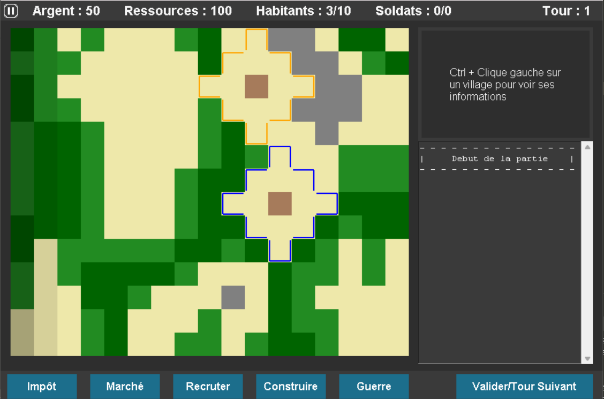
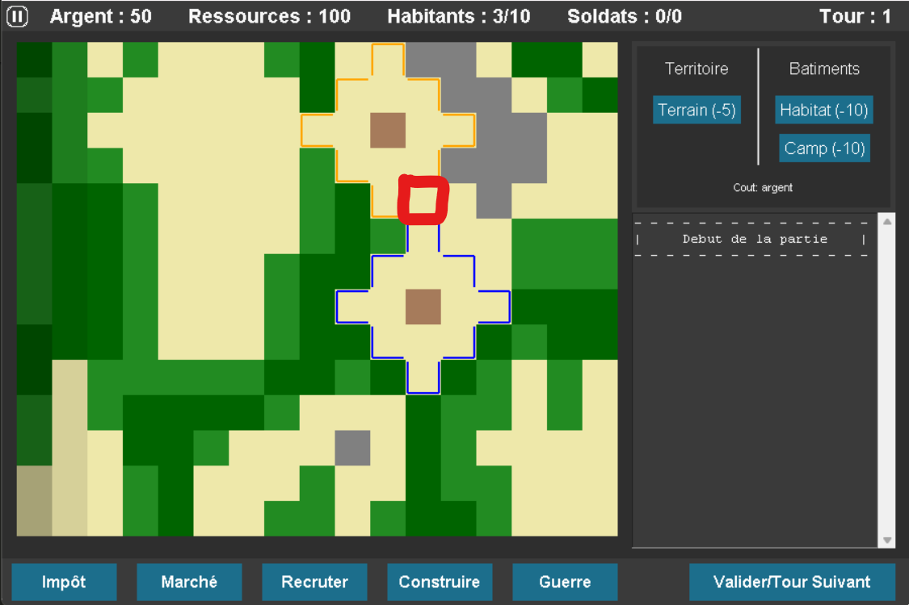
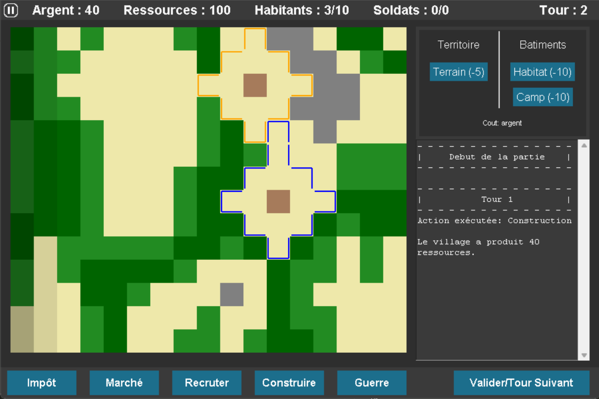
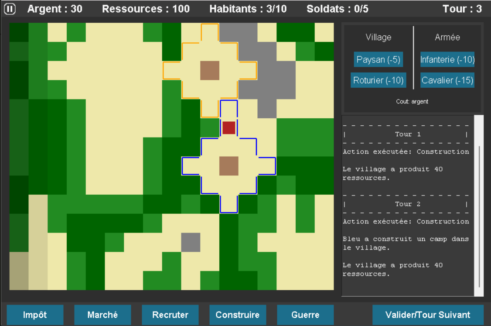
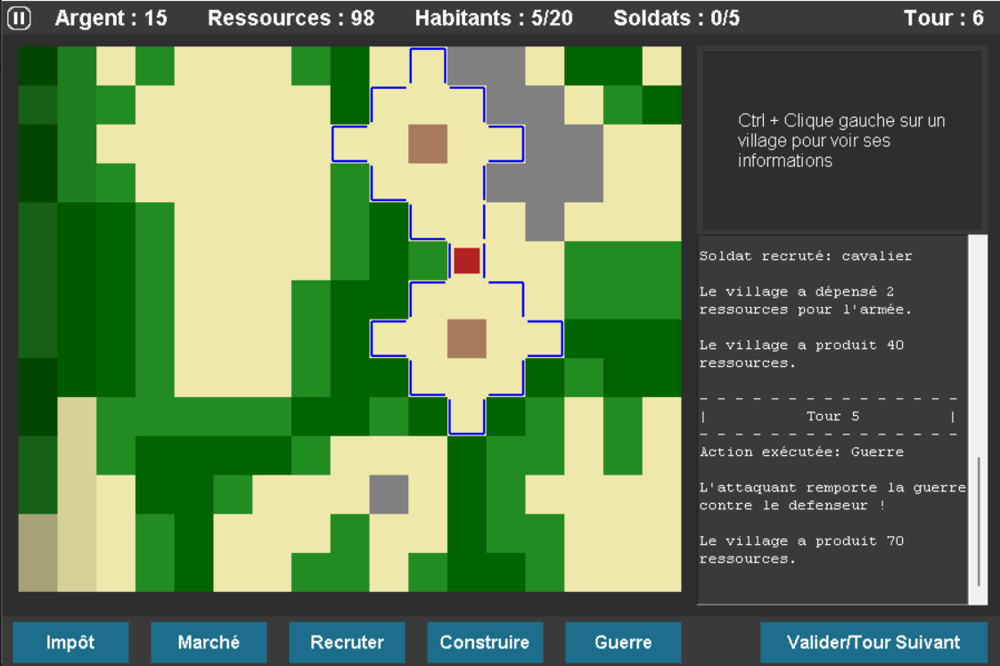
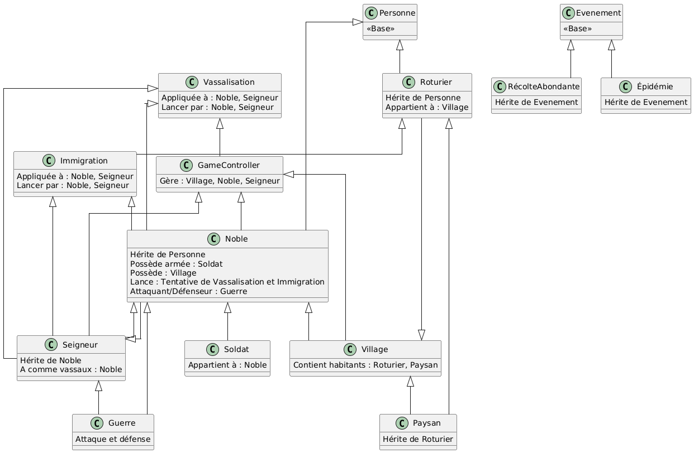

# Compte Rendu du Projet "La Guerre des Frontières"

## Introduction

Ce document présente l'architecture du projet "La Guerre des Frontières", un jeu médiéval basé sur le modèle MVC. Ce projet explore la simulation d'un univers où les interactions entre personnages influencent le déroulement du jeu.

---

## Table des matières

- [Introduction](#introduction)
- [Table des matières](#table-des-matières)
- [Objectifs](#objectifs)
- [Ce qui a été fait / non fait](#ce-qui-a-été-fait--non-fait)
- [Difficultés rencontrées](#difficultés-rencontrées)
- [Qualités Ergonomiques de l’IHM](#qualités-ergonomiques-de-lihm)
- [Exemples d’utilisation ou captures d’écran](#exemples-dutilisation-ou-captures-décran)
  - [Exemple 1: Une capture d’écran de l’IHM principale\*\*](#exemple-1-une-capture-décran-de-lihm-principale)
  - [Exemple 2: explication détaillée d’une conquête d’un village\*\*](#exemple-2-explication-détaillée-dune-conquête-dun-village)
- [Structure du Projet](#structure-du-projet)
  - [Organisation des Classes](#organisation-des-classes)
  - [Relations entre les Classes :](#relations-entre-les-classes-)
  - [Diagramme UML](#diagramme-uml)
- [Méthodologie](#méthodologie)
- [Étapes futures du projet](#étapes-futures-du-projet)
- [Conclusion](#conclusion)
- [Annexes](#annexes)
- [Crédits](#crédits)

---

## Objectifs

Créer une architecture modulaire et extensible qui suivi le modele MVC (Modele Vue Controlleur) et qui facilite la gestion des entités et des interactions.

Mettre en avant une IHM ergonomique respectant des principes de cohérences, flexibilités, et retour d’informations.

Créer un jeu amusant et entrainant !

---

## Ce qui a été fait / non fait

- **Fonctionnalités implémentées :**
  - Boucle de jeu fonctionnelle avec :
    - les évènements : épidemie, recolte abondante.
    - les actions : guerre, immigration, vassalisation... et la possibilite 
    de les utiliser intuitivement grâce a l'IHM.
    - des villages qui sont dirigés par des nobles et qui peuvent s'expendre.
    - des bâtiments qui servent a ajouter des habitants ou des soldats qui se posent sur un territoire aquis.
  - un systeme avancé de Menu et d'UI.
  - un systeme de sauvegarde qui utilise des fichiers json.
  - un systeme de settings qui sont eux aussi sauver grâce à un json.
  - une Map générée grâce au bruit de perlin. La génération entière (même des villages) est soumise à une seed ce qui permet d'avoir le même début de partie que son copain ! 

- **Limitations :**
  - La gestion du bonheur des personnages n'est pas encore implémentée.
  - Il manque aussi beaucoup de tests (beta-testeur) pour avoir une boucle de jeu balancé afin d'avoir un gameplay plus amusant (même si ce n'etait pas le but du projet...).

---

## Difficultés rencontrées

Des légers problèmes d'organisations au début du projet à cause d'un manque de communication des deux parties. Cependant, ce fut vite réglé par un merge effectué en commun pour repartir sur la même base. 

Avoir un code qui respecte pep-8, puisque l'on travaille sur plusieurs fichiers en simultané on ne se rend pas forcément compte des erreurs. Un travail de relecture était donc nécessaire à chaque fin de scéance pour s'assurer de cela. Et que le nom des variables était bien en français (une norme qu'on s'était imposé à nous même au début du projet).

---

## Qualités Ergonomiques de l’IHM

- **Cohérence :** L’IHM conserve des couleurs, des boutons et des icônes uniformes.
- **Concision :** Les joueurs interagissent via des boutons simples et des menus clairs (pas plus de 3 clics pour atteindre l'action souhaitée).
- **Structuration des activités :** Les étapes principales (sélection, action, confirmation) sont guidées par des dialogues.
- **Flexibilité :** Les actions récurrentes peuvent être effectuées avec la souris ou des raccourcis clavier.
- **Retour d’informations :** L’IHM affiche des messages pour valider les actions (ex. : "Village conquis").
- **Gestion des erreurs :** Les erreurs sont signalées par des messages (ex. : "Erreur de sauvegarde") et gérées via des blocs `try` et `except`.

---

## Exemples d’utilisation ou captures d’écran

1. Explication de l'IHM principal.
2. Une explication détaillée d’un scénario (conquête d’un village).  
 
### Exemple 1: Une capture d’écran de l’IHM principale**  
***Capture d’écran montrant l’IHM principale.***  

`*On apperçoit en haut à gauche le bouton pour accéder au menu pause, puis la liste des informations de l'argent, des ressources, des habitants et des soldats que détiens le joueur. A droite de cela on remarque le tour actuel. La plus grande partie de L'IHM définit la map mais à sa droite on voit, en haut : la zone d'information de village, en bas : la zone de log ou le jeu nous indique tout ce qu'il s'y passe. Dans la zone tout en bas se trouve les actions avec le bouton tour suivant.*`

### Exemple 2: explication détaillée d’une conquête d’un village**  
***Capture d’écran montrant l'achat d'une case.***  

`*Le joueur appuie sur le bouton contruire afin d'agrandir son territoire, il choisit l'option terrain puis clique sur la case mis en évidence. Au tour suivant, la case lui appartient.*`

***Capture d’écran montrant la construction d'un camp.***  

`*Le joueur appuie de nouveau sur le bouton contruire , il choisit l'option camp puis clique sur une case de son territoire. Au tour suivant, le camp sera visible sur la case sélectionée et le nombre de soldat possible en haut à droite sera augmenté de 5.*`

***Capture d’écran montrant le recrtement d'un soldat.***  

`*Le joueur peut alors recruter son soldat et faire la guerre !*`

***Capture d’écran montrant le joueur ayant gagné la guerre.***  

`*Le joueur a gagné la guerre ! Dans cet exemple le bot n'était pas activé cependant lors du jeu je vous conseille de mieux vous préparer à la guerre...*`

---

## Structure du Projet

### Organisation des Classes

Voici les principales classes du projet :

- Personne : Classe de base représentant un individu.

- Roturier : Hérite de Personne, représentant une classe sociale plus modeste.

- Paysan : Hérite de Roturier, un roturier spécialisé dans l'agriculture.

- Noble : Hérite de Personne, capable de posséder des armées et des villages.

- Seigneur : Hérite de Noble, chef suprême possédant des vassaux.

- Soldat : Classe indépendante représentant une unité militaire.

- Village : Regroupe des habitants et appartient à un noble.

- Fief : Regroupe plusieurs villages.

- Evenement : Classe de base pour modéliser les événements comme les récoltes abondantes ou les épidémies.

- GameController : Classe centrale gérant les interactions entre les différentes entités du jeu.

### Relations entre les Classes :
- Les relations entre ces classes sont définies de manière hiérarchique ou par composition. Les nobles, par exemple, possèdent des villages, et les seigneurs peuvent tenter de vassaliser d'autres nobles.

### Diagramme UML
- Le diagramme UML ci-dessous illustre les relations entre les différentes classes du projet :
    
    #### Description du Graphe de Classes

    Le diagramme UML illustre les relations suivantes :

    ***Héritage :***
    - Personne est la classe de base pour Roturier et Noble.
    - Roturier est spécialisée par Paysan, et Noble par Seigneur.

    ***Composition :***
    - Un Noble possède un ou plusieurs Villages.
    - Un Fief regroupe plusieurs Villages.

    Ces relations respectent les principes de modularité et facilitent l'extension du projet (ajout de nouvelles classes comme Marchand ou Artisan).

---

## Méthodologie

**Étapes Réalisées :**

1. Analyse des besoins : Identification des entités principales et des interactions nécessaires.
2. Modélisation UML : Création d’un diagramme clair représentant l'architecture.
3. Creation d'une maquette papier de L'IHM (qui nous a servi de base).
4. Implémentation des classes : Développement des classes en Python selon le diagramme défini.
5. Documentation : Rédaction de ce compte rendu.

**Outils Utilisés :**

- `Python` : Langage principal pour le développement.
- `Json` : Fichier utilisé pour la sauvegarde des éléments.
- `PlantUML` : Description graphique de l’architecture du projet.  

---

## Étapes futures du projet
**Améliorations envisager pour la suite :**

- Ajouter une gestion avancée du bonheur des personnages.
- Implémenter un système de commerce avec les autres villages.
- Créer une forme de diplomatie et/ou politique qui tenterai plus à la vassalisation qu'à la guerre.
- Un système de sauvegarde où le joueur n'a pas à decider où il conserve sa partie, et ou le jeu proposerai de charger n'importe quelle partie sauvée auparavant.
- Une fonctionnalité futur intérresante serait aussi *Un mode multijoueur* cependant ceci apporte de nombreuses questions de sécurités...

---

## Conclusion

Le projet "La Guerre des Frontières" offre une structure claire et modulable, facilitant l'ajout de nouvelles fonctionnalités. Le diagramme UML permet de visualiser efficacement les relations complexes entre les différentes entités. Ce compte rendu servira de référence pour toute évolution du projet. Celui-ci fût prenant et plein d'enthousiasme de notre part nous n'avons donc pas compté nos heures ni nos lignes écrites voilà pourquoi il n'y a aucune rubrique prévu à cet effet.

---

## Annexes

Fichier PlantUML (.puml) : Code source pour le diagramme UML (disponible dans le folder Rendu).

---

## Crédits

Ce jeu a été devellopé par:
- `Joshua Dixon`
- `Austin LaRoque`